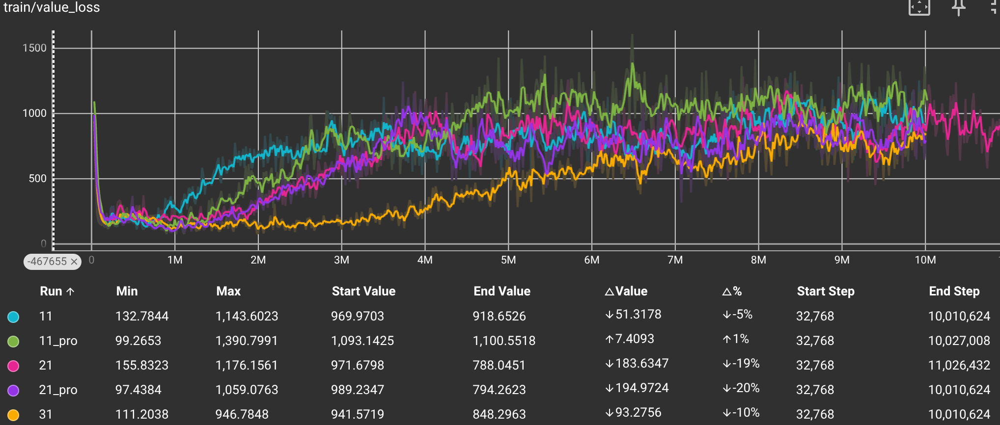
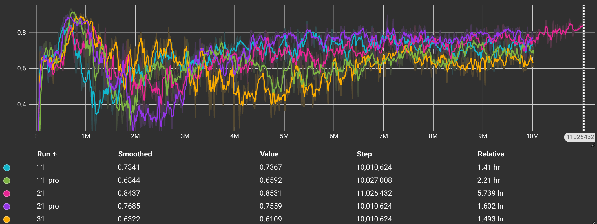
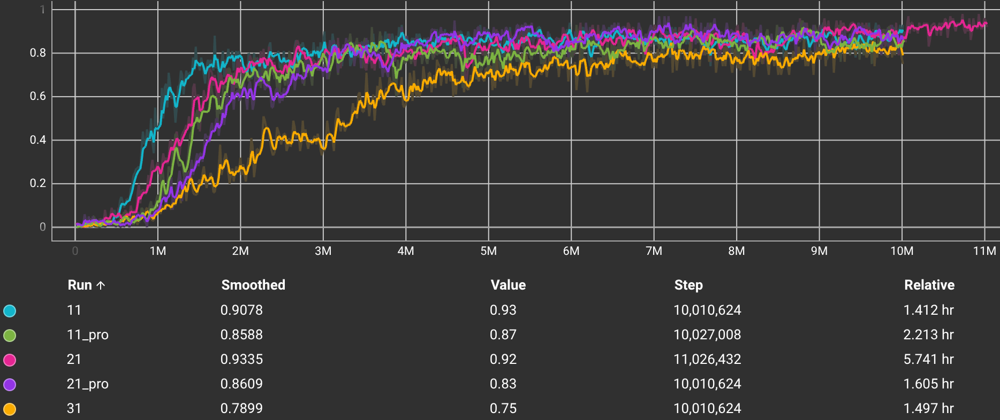
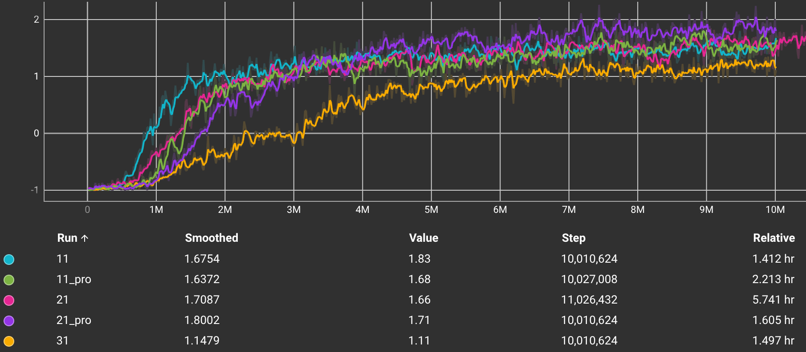
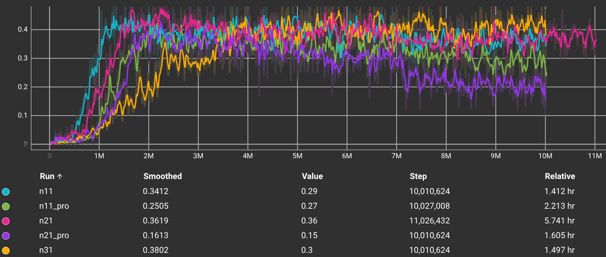
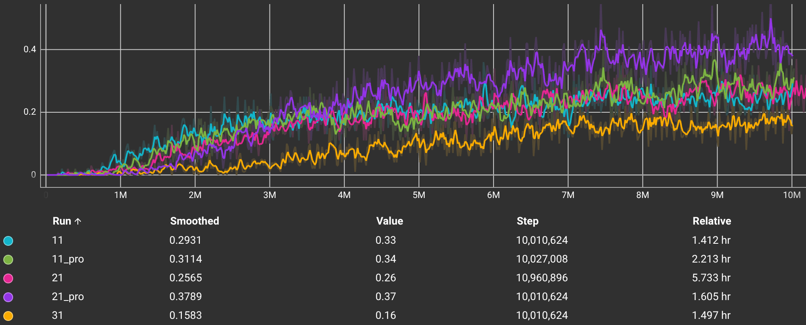

# 專案報告：基於雷達觀測空間之登月小艇強化學習訓練

## 1. 動機與目的

### 1.1 動機
在傳統的強化學習環境（例如 Gymnasium 的 LunarLander）中，代理程式 (Agent) 通常透過直接讀取環境的絕對狀態（如明確的 X/Y 座標、速度、角度）或直接處理高維度的像素畫面 (Pixels) 來進行學習。為了探索代理程式在受限觀測條件下的學習與適應能力，本專案開發了一個客製化的登月小艇 (Radar Moon Lander) 環境。
此設計模擬了現實中探測器僅能依賴局部感測器（如光達或雷達射線）來感知周遭地形的情況。代理程式必須藉由發射多條射線來測量與地形及降落平台之間的距離，以此作為決策依據，使得問題更具挑戰性且貼近真實物理限制。

### 1.2 目的
* **實作客製化環境**：建立一套相容於 `Farama Gymnasium` 標準介面的雷達登月環境，其中包含重力、主引擎推力及側邊旋轉姿態控制的物理模擬。
* **模型訓練與驗證**：利用 `Stable Baselines 3` (SB3) 中的 **PPO (Proximal Policy Optimization)** 演算法，搭配多層感知器 (MLP) 進行訓練，使其能在僅有雷達觀測的條件下成功完成平穩登陸。
* **效能分析與指標探討**：透過 TensorBoard 記錄的訓練指標，分析並比較不同實驗組別（如 `21` 與 `21_pro`）的學習曲線，評估模型收斂的表現與穩定度。

---

## 2. 方法與素材

### 2.1 實驗環境 (Radar Moon Lander)
本環境主要包含以下特性：
* **狀態空間 (Observation Space)**：代理程式預設可發出 20 條雷達射線，測量機體與下方地形或平台的距離。觀測向量亦包含當前的座標、速度、角度與剩餘燃料等資訊。
* **動作空間 (Action Space)**：採用連續動作空間 (Continuous Action Space)，範圍為 `[-1.0, 1.0]`，分別控制：
  1. 主引擎推力（克服重力與減速）
  2. 側向引擎推力（控制機體旋轉與姿態）
* **獎勵函數 (Reward Function)**：
  * **引導獎勵 (Shaping)**：隨著接近目標點、降低速度與平穩角度，給予漸進式獎勵。
  * **懲罰 (Penalty)**：包含消耗燃料、角速度過大、墜毀 (`-100` 分) 或飛出邊界。
  * **成功登陸 (Success)**：在降落平台平穩著陸，會根據平台的難度係數（Multiplier 1, 2, 3）給予大幅度獎勵。

### 2.2 訓練演算法與硬體
* **演算法**：PPO (Proximal Policy Optimization) 
* **神經網路架構**：多層感知器 (MLP Policy)
* **軟體與框架**：Python 3、PyTorch、Farama Gymnasium、Stable Baselines 3
* **實驗組別**：我們比較五組主要的實驗設定，旨在探討「雷達感知能力」與「獎勵機制」對著陸表現的綜合影響：
  * **`21` (粉色)**：基準組（標準版）。21 射線，具備著陸容忍度 (Tolerance)。
  * **`21_pro` (紫色)**：優化組。21 射線，**移除容忍度**並調整獎勵權重（鼓勵挑戰高分平台）。
  * **`11_pro` (綠色)**：輕量觀測優化組。11 射線，同樣採用移除容忍度與獎勵調整策略。
  * **`11` (藍色)**：輕量觀測組。11 射線，具備著陸容忍度。
  * **`31` (橘色)**：高維觀測組。31 射線，具備著陸容忍度。

---

## 3. 結果討論與結論

我們透過 TensorBoard 收集並分析了訓練過程中的各項自定義與 PPO 預設指標。以下為三個關鍵指標的趨勢與比較討論：

### 3.1 價值損失 (Value Loss) 與 解釋變異量 (Explained Variance)
`value_loss`（評論家損失）衡量了模型（Critic）預測「預期分數」與「實際得分」之間的差距。
`explained_variance` 則反映了評論家 (Critic) 預測未來的準確度百分比。數值越接近 1，代表評論家對於當前局面能拿到多少分數的判斷越準確（0 代表亂猜，1 代表完美預測）。

* **價值損失趨勢分析**：在訓練初期（約 2M 步以前），兩個模型的 `value_loss` 均快速下降，代表評論家網路迅速掌握了環境的基本獎勵機制（如墜毀會受到極大懲罰）。隨後（2M 步至 4M 步），`value_loss` 出現大幅攀升並進入震盪期。此現象在 PPO 訓練中符合預期，因為代理程式開始學會高難度動作並獲得高額獎勵（成功登陸），導致回合的總回報 (Return) 規模變大且不確定性增加，使得預測難度短暫提升。
* **價值損失組別比較**：在約 2.5M 步的紀錄點，`21` 的 smoothed loss 為 `503.6`，`21_pro` 為 `409.7`。兩者整體的收斂形狀相當一致，均在後段進入平穩的高原震盪期。
* **評論家極為優秀的預測能力**：從 `explained_variance` 的數據中，可以清楚看到我們的評論家 (Critic) 表現非常卓越。
  * **最佳預測表現**：`21` 達到了驚人的 **0.8437**，`21_pro` 則為 **0.7685**。這表示在 21 條射線的配置下，評論家能極其精準地預判雷達訊號帶來的潛在價值。
  * **感知邊際效應**：值得注意的是，當射線增加到 31 條時 (`31`)，`explained_variance` 反而下降至 **0.6322**，顯示過多的觀測資訊可能引入了額外的學習雜訊，反而降低了評論家的判斷準確度。
  * **輕量配置表現**：僅使用 11 條射線的 `11_pro` 仍保有 **0.6844** 的預測水準，證明了雷達觀測系統的高效性。

### 3.2 成功率 (Success Rate)
`custom/success_rate` 記錄了模型在過去 100 個回合中，成功降落在平台且未墜毀的比例（1.0 代表 100% 成功）。

* **趨勢分析**：此為評估代理程式是否具備「基本生存與登陸能力」的最直觀指標。0 ~ 1M 步時，成功率趨近於 0，為隨機探索階段。
* **組別比較**：
  * **穩定性冠軍**：`21` (粉色) 最終達到了 **0.9335** 的成功率，顯示在具備容忍度與適中射線數量下，模型最容易學會「安全降落」。
  * **感知數量的陷阱**：`31` (橘色) 的成功率僅為 **0.7899**，是所有組別中最低的，再次驗證了並非觀測資訊越多學習效果就越好。
  * **移除容忍度的代價**：`21_pro` (**0.8609**) 與 `11_pro` (**0.8588**) 因為拔除了 Tolerance，著陸判定更為嚴苛，因此成功率略低於基準組，但仍維持在 85% 以上的高水準。

### 3.3 平均得分 (Score Mean) 與 降落區分佈 (Pad Rates)
為了進一步分析代理程式的「著陸品質」，我們觀察了平均得分以及在不同難度平台（Pad 1, 2, 3）的著陸佔比。

* **平均得分與技術展現**：
  * **`21_pro` (紫色)** 雖然成功率非最高，但其平均得分 **1.8002** 為全場最高。
  * **`11_pro` (綠色)** 表現亮眼，平均得分達 **1.6372**，優於 31 射線配置。
  * **`31` (橘色)** 分數最低，僅 **1.1479**。

* **著陸策略分析 (獎勵調整的效果)**：
  * **高分區挑戰者 (`Pad 3`)**：採取 `pro` 策略的組別展現了強大的進攻性。`21_pro` 在高分區 (Pad 3) 的著陸率高達 **37.89%**，顯著高於基準組 `21` 的 26.99%。
  * **低分區避讓 (`Pad 1`)**：由於 `pro` 組別降低了低分區獎勵，`21_pro` 的 Pad 1 著陸率僅 **16.13%**，與之相對的是 `21` 仍有 36.19% 選擇停留在舒適圈（低分區）。
  * **感知能力的邊界**：`31` 在所有 Pad 的表現均較差，尤其在 Pad 3 的達成率僅 15.83%，顯示過於複雜的輸入可能干擾了模型對高難度目標的精確導引。

### 3.4 問題與討論
* **Q1：學習效率不好，經過訓練成效不夠？**
  * **解法**：在降落模擬中，可以先縮小雷達感測的範圍（如限制在特定象限或範圍內），確保 Agent 能更集中地處理關鍵地形資訊。
* **Q2：火箭總是就近降落，不會去搶高分？**
  * **解法**：
    1. **射線數量調整**：實驗發現奇數條射線（如 21）有時比偶數條更能準確對準中心。
    2. **地形平滑化**：減少極端尖銳的地形，讓 Agent 更容易探索到不同區域。
    3. **獎勵函數優化**：大幅提高 Pad 3 的權重，並移除著陸容忍度 (No Tolerance)，強迫 Agent 必須精準降落才能得分。

### 3.5 AI 使用與協作
在本專案的開發過程中，AI 扮演了重要的輔助角色：
* **介面開發**：協助調整 PyGame UI 顯示、雷達渲染效果。
* **參數調優**：與 AI 討論模型超參數（Learning Rate, Batch Size）的設定。
* **視覺化**：設計 TensorBoard 自定義面板與 Demo 展示介面。

### 3.6 結論
1. 本專案成功建立了一個以「雷達射線 (Rays)」為觀測空間的登陸環境，並證實了代理程式能夠擺脫對絕對全域狀態的依賴，僅依靠局部雷達測距與本體姿態數據，學會精準著陸。
2. PPO 演算法在應對連續動作控制與客製化獎勵函數上展現了極高的穩定度。代理程式在歷經約 200 萬步的探索後掌握了基本生存，並在千萬步時達到了 86% ~ 93% 的優異成功率。
3. 比對不同訓練設定（`21` 與 `21_pro`），模型在早期學習速度與後期挑戰高難度平台的傾向上有細微差異，但最終的技術得分 (1.7 ~ 1.8) 皆證實了該網路架構與觀測系統的可行性與強健性。

---

## 4. 參考資料

1. **Farama Gymnasium**: 強化學習環境的標準 API 與開發框架。
   * [https://gymnasium.farama.org/](https://gymnasium.farama.org/)
2. **Stable Baselines 3 (SB3)**: 提供基於 PyTorch 的強化學習演算法實作庫。
   * [https://stable-baselines3.readthedocs.io/](https://stable-baselines3.readthedocs.io/)

## 5. 專案成員與分工
* **郭子謙**：專案架構設計、環境空間建置。
* **闕壯丞**：演算法實作、相關文獻探討。
* **簡嘉萱**：數據分析、指標整理。
* **陳彥丞**：測試與調參。
